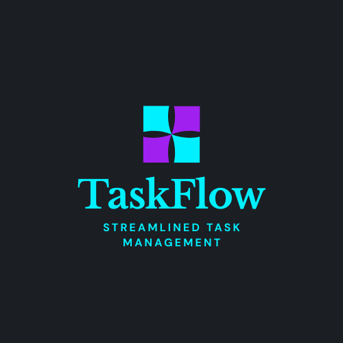
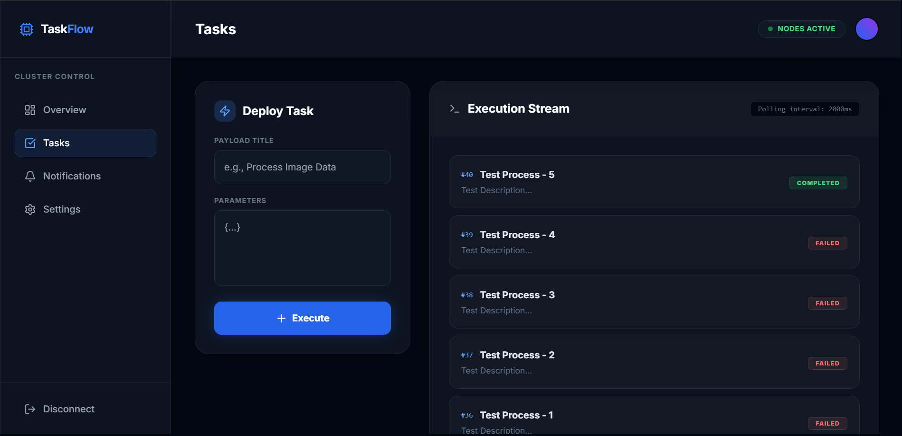
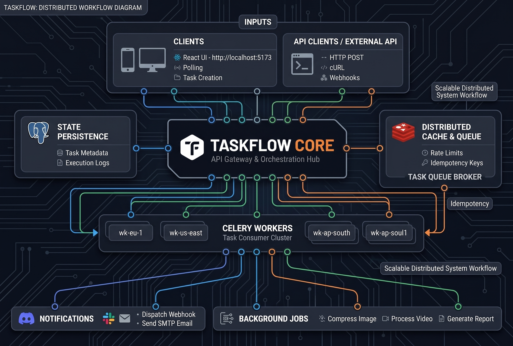

 
  

<h1 align="center"> TaskFlow: Distributed Processing Engine </h1>
<h3 align="center"> Scalable Notification & Asynchronous Task Queue </h3>

 

I have developed an enterprise-grade distributed processing system that decouples resource-intensive tasks from synchronous REST APIs. It offloads heavy workloads to background worker nodes via a message broker, ensuring high availability, fault tolerance, and horizontal scalability.

<h2> :floppy_disk: Architecture & Components </h2>

This project is orchestrated via Docker and divided into decoupled microservices:

<h4>Backend Services:</h4>
<ul>
  <li><b>FastAPI (API Gateway)</b> - Handles incoming HTTP requests, validates payloads, enforces Redis-backed rate limiting, and writes initial state to PostgreSQL.</li>
  <li><b>Celery (Worker Nodes)</b> - Asynchronous background processors that pull tasks from the message queue, execute them (e.g., Discord webhook dispatching), and update the database state.</li>
</ul>

<h4>Infrastructure:</h4>
<ul>
  <li><b>Redis (Message Broker)</b> - Acts as the high-speed, in-memory conveyor belt passing task IDs from the API to the workers.</li>
  <li><b>PostgreSQL (Datastore)</b> - ACID-compliant relational database for persisting task metadata, timestamps, and execution status.</li>
</ul>

<h4>Frontend Directory:</h4>
<ul>
  <li><b>React & Vite</b> - A high-performance, Single Page Application (SPA) dashboard utilizing Tailwind CSS for glassmorphism styling and Recharts for real-time telemetry visualization.</li>
</ul>

<h2> :book: Distributed Event-Driven Architecture</h2>

In traditional monolithic architectures, executing resource-intensive tasks within the lifecycle of a synchronous HTTP request leads to connection timeouts and poor user experience. Abstractly, this system solves the problem by acting as an asynchronous backbone.

When a client submits a payload, the system instantly acknowledges the request (HTTP 202 Accepted) and assigns probabilities of execution by dropping a serialized message onto the Redis queue:

The Celery workers continuously monitor this broker. Once a task is acquired, an atomic lock prevents other workers from duplicating the effort. The worker processes the external webhook and mutates the final state in the database, allowing the React frontend to actively poll and update the UI in real-time.

<h2> :clipboard: Execution Instruction</h2>

The entire cluster is containerized and can be spun up using Docker Compose.

<b>1) Environment Configuration</b>

Create a <code>.env</code> file in the root directory and define your external integrations:

<pre><code>DISCORD_WEBHOOK_URL="https://discord.com/api/webhooks/..."</code></pre>

<b>2) Build & Run Cluster</b>

Execute the following command to download the Postgres/Redis images, build the Python containers, and map the ports:

<pre><code>docker-compose up --build -d</code></pre>

<b>3) Access Telemetry Dashboard</b>

Once the containers are successfully running, the React application will proxy requests to the backend. Access the UI at:

<pre><code>http://localhost:5173</code></pre>

<h2> :books: Core Technologies</h2>
<ul>
  <li>
FastAPI Framework. [Online].

      
Available: https://fastapi.tiangolo.com/

  </li>
  <li>
Celery: Distributed Task Queue. [Online].

      
Available: https://docs.celeryq.dev/en/stable/

  </li>
  <li>
Redis In-Memory Datastore. [Online].

      
Available: https://redis.io/

  </li>
  <li>
React & Vite Tooling. [Online].

      
Available: https://vitejs.dev/

  </li>
</ul>

